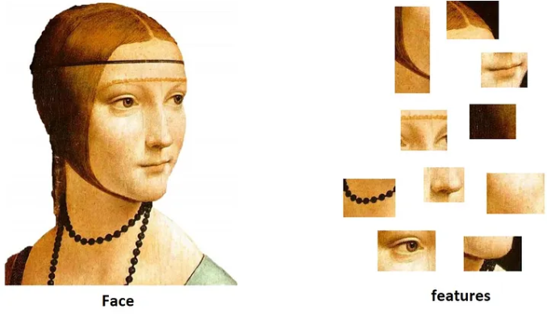

Bow sift
Cuando se usan los detectores de caracteristicas, estas se hacen localmente, por lo que cada imagen tiene su propio conjunto de carcateristicas, y pueden haber imagenes con muchos keypoints como puede que hayan otras con pocas, por lo que al momento de hacer un entrenamiento con deep learning o machine learning, van a haber errores por la dimensionalidad la cual se esta usando para el entrenamiento.

# Bag Of Visual Words
Es una tecnica con la que se busca describir y computar la similitud entre imagenes, es usada para la clasificacion de imagenes.
 
Primero se dividen las imagenes en un conjunto de caracteristicas, las cuales estan constituidas por keypoints y detectores.
 

 
los keypoints son puntos distintivos o carcateristicos de una imagen que son seleccionados debido a su singularidad, son puntos de referencia, los descriptores son la representacion numerica de las carcateristicas visuales de una region al rededor de ese keypoint, contienen informacion como lo seria la intensidad de los pixeles, la orientacion del gradiente.
 
Se crea un diccionario con los descriptores usando algoritmos de clustering, despues se itera por las imagenes verificando si la imagen contiene partes que esten en el diccionario, por lo que si esta presente se va aumentando el  numero de esa caracteristica.
 
Se escogen unas caracteristicas comparandolas con las demas buscando  la mas cercana a los datos de entrada.
A cada imagen, se le haya su caracteristica y con su descriptor, los vectores se ubican en un espacio, esto se realiza con todo el conjunto de los datos.
 
Se usa un aprendizaje no supervisado como lo seria  K-means, para que el algoritmo pueda encontrarlas solo con las caracteristicas que encontro n cada imagen.
Los keypoints que vienen en los descriptores, y despues diviendolos por la cantidad de carcateristicas que queramos usar con klusters
 
k-means mueve los centros, y cada centro dice sobre los centros de cada caracteristicas.
Una vez con los centros, se quedan con esos vectores que hacen informacion a este, 
La codificacion es cambiar los keypoints en una forma de manera numerica para poder identificarlo de una manera, despues se agrupa por esta codificacion la cual se hizo .
 
Una vez completada la codificacion, se hace un histograma para poder hacer la visualizacion de la distribucaion de la cantidad de caracteristicas que hayo por imagenes
 

 
se extrae caracteristicas de la imagen las cuales no vayan a variar de imagen a imagen
despues se genera el vocabulario digital, lo que hace es obtener los keypoints mas importantes, bins histograma.
Vector de palabras visuales lo que se hace es deteerminar la cantidad de veces que aparecen estos keypoints en las imagenes para poder hacer el conteo
 

