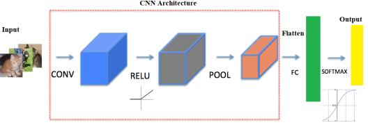

# Redes Neuronales convolucionales 
## La convolucion:
Es la operacion matematica que permite la aplicacion de filtros digitales en el dominio del tiempo.
Una imagen es una representacion visual de matrices numericas, la cual esta compuesta de 3 canales, rojo, verde y azul, donde la sumatoria de estos es el color de cada pixel.
>
Como las imagenes son unas matrices numericas, se puede usar filtros los cuales pasan por esta imagen, y se utilizan para poder detectar contornos en algunas imagenes, existen horizontales y verticales.
Estos filtros se colocan por encima de la matriz de la imagen obteniendo el producto punto de ambas y despues teniendo como resultado la convolucion de ambas y siendo una nueva imagen con la informacion obtenida.
>

>
En la imagen anterior se observa lo que seria el funcionamiento de un filtro sobre una imagen. se tiene una imagen 7x7 con un filtro de 3x3, la dimension de la imagen viene dada por ser la resta entre el la dimension del filtro - 1 - la dimension por la dimension de l imagen inicial.
>
Como se observa tambien en la imagen anterior tenemos que con el uso del filtro la imagen disminuye esa dimensionalidad, por lo que en momentos se requiere usar padding para poder evitar que esta dimensionalidad de la imagenes no dismuya, por lo que consiste agregar una capa de pixel al borde de la imagen original, este borde puede tener cualquier numero.

>
Con la imagen anterior al aplicar el filtro 3x3 no se va a perder la dimensionalidad de la imagen.
>
Al igual que como se observa en la imagen el filtro pasa pixel por pixel, hacia la derecha, por lo que esto se conoce como seria **stride**, esto determina la cantidad de pasos que dara.
>

>
En la imagen anterior se puede observar una imagen con stride=2 por lo que la dimensionalidad de la imagen se vera mas reducida.
>
### Max-pooling
Es una operacion que permite analizar el contenido de una imagen por regiones, para poder extraer la informacion mas representativa de cada bloque, permite reducir la cantidad de datos de una capa y otra capa, facilitando el procedimiento de esta.
>
El funcionamiento de este es que se dividen las imagenes en regiones del mismo tamaño, y por cada region se extrae el valor maximos.

# Arquitectura de una ConvNet
Para el funcionamiento de una red convolucional tenemos principalmente nuestras caracteristicas de entrada que son las imagenes las cuales se utilizaran para poder realizar todo el entrenamiento.
>
Nuestra capa de convolucion que es toda la parte de filtros que realizamos, despues se tiene una capa de activacion con relu, ya que es una funcion de 0 hasta infinito por lo que es perfecta para imagenes, despues tenemos una capa de pool para las dimensiones, y por ultimo tenemos la conexion con las demas capas, que esta compuesta por un flatten que es para poder aplanar y tener en un mismo vector todas las imagenes y por ultimo si es clasificacion tenemos una funcion softmax que nos devuelve la probabilidad de cada clase.

>
En la siguiente imagen se puede ver como se conectan todas las neurona en un feed forward para el entrenamiento de nuestra red, donde la primera neurona se conecta con todas las siguientes, teniendo informacion de todas las anteiores.

feed forward
>

>

En la imagen anterior se tiene un ejemplo de una red convolucional y estos son los pasos que se siguen:
<ol>
<li>En la primera capa tenemos nuestra entrada de caracteristicas, con dimensiones de 32,32 y de 3 canales</li>
<li>Se tiene un primera red de convolucion con un filtro de 5x5 y un stride de 1, obteninedo una imagen de 28,28,8 </li>
<li>despues se tiene una capa de pooling reduciendolo a la mitad</li>
<li>Despues se tiene un filtro de 5 nuevamente por lo que se reduce a una dimension de 10,10 con 16 canales</li>
<li>Se tiene otra capa de pooling reduciendolo a la mitad</li>
<li>Tenemos una capa de convolucion con 120 neuronas</li>
<li>Tenemos una capa de convolucion con 84 neuronas</li>
<li>Tenemos una capa de convolucion con 10 neuronas con una funcion softmax, por lo que se trata de clasificar entre 10 clases</li>
</ol>

>
# Underfitting and Overfitting

### Underfitting
Cuando un modelo no ha aprendido bien los patrones de los datos de entrenamiento y no puede generalizar bien los nuevos datos, se conoce como ajuste insuficiente. Un modelo de ajuste insuficiente tiene un rendimiento deficiente en los datos de entrenamiento y dará lugar a predicciones poco fiables. El subajuste se produce debido a un alto sesgo y una baja varianza.
>

>

>
Cuando ocurre un underfitting lo mejor es revisar la complejidad del modelo, y si es posible aumentarle esa complejidad, ademas tambien de variar valores como lo seria el learning_rate o la cantidad de epocas en la cual se esta entrenando

### Overfitting
Cuando un modelo funciona muy bien para los datos de entrenamiento, pero tiene un rendimiento deficiente con los datos de prueba (datos nuevos), se conoce como sobreajuste. En este caso, el modelo de aprendizaje automático aprende los detalles y el ruido de los datos de entrenamiento, de modo que afecta negativamente al rendimiento del modelo en los datos de prueba. El sobreajuste puede ocurrir debido a un sesgo bajo y una varianza alta.
>

>

>

>
Para estos casos en los que se encuentre el modelo con overfitting, lo que se puede realizar es verificar la complejidad y reducirlo, verificar el learning_rate, usar regularizadores, o capas de dropout
>

>
Para un modelo bien se debe de tener que la distancia entre la  validacion y el entrenamiento es minima, que ambas tambien se estabilizan en un punto.

# Tecnicas de regularizacion
1. Reduccion de la complejidad del modelo
>
- En momentos los modelos los cuales se tienen son o muy complejos o muy sencillos los cuales generan ciertos problemas al momento de entrenar y realizar la validacion, por lo que se recomienda es ir realizando pruebas con diferentes modelos, y siempre graficar para lograr ver el comportamiento de estas
>
2. Early Stooping
- Esta es una estrategia muy usada en los modelos con epocas muy grandes, debido a que se busca poder hacer un control de lo que seria estos valores y siempre llevandole la cuenta a estos para tratar de asegurar de evitar que el modelo diverga y se pierda lo que ya se llevaba.
>
3. Dropout
- La capa de dropout se utiliza en la mayoria de reds de alta complejidad para evitar ese overfitting que se pueda llegar a presentar, lo que trata es ir apagando un porcentaje de neuronas en el momento en el cual se realiza el entrenamineto, y este valor depende del valor el cual nosotros le demos, no hay un valor establecido, recuerda siempre probar y visualizar para encontrar los mejores valores para tu red.
>
4. Aumento de datos
- El aumento de datos tiene multiples funcionamientos, como lo seria como su nombre dice aumentar las imagenes las cuales se estan usando, pero las aumenta con distorciones, giros, ruido y mas, todo esto depende de lo que tu quieres añadirle, sirve para que la red pueda aprender con un formato de imagenes diferentes, se le obliga a la red que generalice con los datos.
>
5. Regularizadores
- L1 (Lasso): La regularización L1, también conocida como regularización Lazo o Lasso, añade una penalización igual a la suma de los valores absolutos de los pesos del modelo multiplicados por un factor de regularización (lambda). Esto tiene el efecto de empujar algunos pesos hacia cero, lo que resulta en un modelo más simple y interpretable.
- L2 (Ridge): La regularización L2, también conocida como regularización Ridge, añade una penalización igual a la suma de los cuadrados de los pesos del modelo multiplicados por un factor de regularización (lambda). Esto tiende a distribuir el error entre todos los pesos, lo que resulta en un modelo más suave y menos propenso al sobreajuste.
