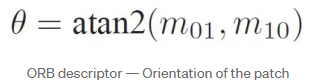

Descriptors
Es un metodo con el cual se pueden extraer caracteristicas descriptivas de un punto de interes, o de una imagen completa, son como una huella digital la cual ayuda a distinguir entre una caracteristica y otra, convirtiendolas en una cadena de numeros.
 
scale invariance
invariante a la escala y a la rotacion, 

SIFT -> Es un extractor de caracteristicas, 
1. Se va a ubicar los posibles key points en el espacio de escala
2. Se colocan de una manera precisa los keypoints
3. Se asigna una orientacion para tratar de hacerlo invariante a la rotaciono
4. Describe los puntos claves a una dimension de alto vector 
 

# Explicacion de cada componente
1. Scale space extreme detection
 

la imagen se le hacen distintas escalas para hacerla que no varie, le aplica gaussianos con distintos sigmas, 
La diferenciacion permite calcular los cambios que hay en las imagenes, El numero mas grande es donde el cambio se identifica a mayor escala, 
Lo que se hace es que cada matriz se le reduce la dimension y ademas tambien se le aplica un filtrado, despues se va pasando por cada matriz buscando el numero mas grande en cada escala, y despues va a marcarlo para indicar que tenemos un key point
Cuando en un histograma tenemos en una misma parte dentro de un rango pequeño se le llama histograma de bajo contraste, sin embaego si tenemos uno donde esta por todo el plano es de alto contraste

2. Keypoint Localization. 
 
Para algunos puntos los cuales estan ya sea en partes donde no hay mucho cambios de contraste o que estan en los bordes se eliminan ya que no contienen mucha importancia como caracteristica, 
Para bajo contraste de las caracteristicas simplemente miramos la intensidad de estos, si la intensidad es menor a 0.03 significa que esta en bajo contraste lo que haria es que se deshecharia

3. Orientation Assigment
 
Con el histograma de 36 bins, se considera el pico mas grande, para poder darle  una orientación.

4. Keypoint Description
 
Para tener un vector mas controlado el cual ayuda a buscar si las carcateristicas coinciden, se describen, y surgen de las orientaciones, se divide en una matriz de 16x16 y despues se buscan las orientaciones, y por cada cuadro se sacan 8 orientaciones
se emparejan los descriptores,  

### SIFT 
Las ventajas de sift -> se van a encontrar keypoints por imagen por eso es local
1. Caracteristicas locales, para cada imagen se realiza el proceso
2. Genera gran cantidad de caracteristicas e incluso en imagenes pequeñas
3. es muy eficiente
 4. Puede ser usando en diferentes tipos de caracteristicas

# SURF (Speeded-Up Robust Features)
es un detector de caracteristicas y descriptor, se usa en reconocimiento de objetos, registro de imagenes, classificacion, o reconstruccion 3d, se inspira en el descriptor **SIFT**.
Usa deteccion por matriz de hesse, esta matriz se llena con la segunda derivada de la imagen.
 

Donde los valores de Lxx,Lxy,Lyy son esta segunda derivada de la imagen, en una direccion.
La imagen original se compone del valor aproximado del determinante de matriz de cada pixel.
 

El valor de 0.8 es empirico, ya que se requiere el suavizado Gaussiano, este utiliza lo que seria filtros de caja, ya que al obtener las derivadas de ambos lados se puede representar con numeros, lo que hace que sea mas eficiente el calculo.

Una de las mayores diferencias con sift, es que antes se escalaban las imagenes a diferentes tamaños, en este caso con surf se escala de diferentes tamaños el filtro
 

Despues el posicionamiento de estos puntos caracteristicos, este se hace haciendo una comparacion entre todos los filtros que ya se tienen buscando el maximo o el minimo.
 

Tambien se eliminan aquellos numeros los cuales sean inferiores al umbral, lo que reduce la cantidad de caracteristicas.

Para determinar la direccion de estos puntos, no se toma el histograma de gradiente, el punto caracteristico como centro se calcula el radio de 6s, esta s es el valor de la escala del punto caracteristico, y se suma la respuesta de los puntos en ese sector en ambas direcciones, la respuesta cercana a el punto tiene mas valor que las que estan alejadas.
 

Se toma un marco cuadrado alrededor del punto, este se divide en 16 regiones, estas regiones cuentan las caracteristicas de las ondas haar de 25 pixeles en las direcciones horizontales y verticales.
 

por lo que cada area tiene 4 valores, por lo que se habla de que tiene un vector de 64D, que es la mitad del SIFT.

# ORB (Oriented Fast and Rotated BRIEF)
Es un detector de caracteristicas, es eficiente y bajo de memoria
Utiliza primeramente un detector FAST para poder hacer la seleccion de las caracteristicas.
La forma como funciona FAST, es que se da un punto central denominado p, este valor se compara en intensidad en un circulo de 16 pixeles, despues estos pixeles estar organizados en 3 clases, dependiendo a las escalas con relacion a p, si mas de 8 pixeles son mas oscuros, o mas claros que p, se elige como keypoint.
Pero este no tiene un componente de orientacion o de caracteristicas multiescalas, por lo que usa un algoritmo de multiescala piramidal, son la misma imagen pero a diferentes resoluciones.
Una vez completado la piramide se usa FAST para calcular los keypoints atravez de diferentes escalas y asi sea invariante a la escala.
 

Una vez localizado los keypoints, falta poder calcular la orientacion de estos, utiliza las intensidades de los centroides para poder calcular la direccion que va a tener.
El momento es calcula con los valores de x, y por las intensidades de estos.
 

 
Una vez calculado los momentos se puede encontrar los centroides, que son la relacion de la diferencia de estos

 
Y los angulos son calculados usando las esquinas de los centroides.
 

Despues se usa brief( Binary robust independent elementary feature).
tomas todos los puntos de el algoritmo de FAST y los convierte a unos vectores de caracteristicas binarias, empieza usando un kernel gaussiano para prevenir que el descriptor sea sensible a ruidos de alta frecuencia.
despues con los keypoints obtenidos se van a seleccionar un par random de pixeles al rededor, a este espacio se le denomina patch, el primer pixel se saca de de una distribucion gaussiana de al rededor del centro del punto, y el segundo se saca de la distribucion del pixel obtenido.
Si el primer pixel es mas intenso que el segundo se le asigna un valor de uno, si no se le asigna un 0, esto se hace durante 128 veces por keypoint

# HARRIS CORNER 
Una esquina es un punto donde el gradiente del contraste es maximo en una dirección y mínimo en otra.
En el momento que se mira la parte plana, y se mira un gradiente de este se observa que es constante por lo que no hay cambios y no se detecta nada, la esquina hay un un cambio pero no lo suficiente, en cambio cunado se compara con el borde, si hay un cambio mayot, en todas las direcciones.

 

Se empieza mirando una pequeña ventana alrededor de un pixel en la imagen, queremos identificar los pixeles unicos, por lo que miramos la diferencia de los valores en los pixeles.
se calcula la diferencia sumada al cuadrado (SSD) de los valores de píxeles antes y después de desplazar la ventana. Este SSD se calcula para desplazamientos en todas las ocho direcciones (por ejemplo, arriba, abajo, izquierda, derecha y diagonales).
Los píxeles con valores grandes de E(u,v) se consideran características en la imagen. Estos son típicamente esquinas u otras estructuras distintivas. Se puede aplicar un umbral para determinar qué píxeles se consideran características en función de la magnitud de E(u,v).
El objetivo de la detección de esquinas es maximizar la función E(u,v). Esto implica maximizar el segundo término de la ecuación proporcionada.
Aplicando técnicas matemáticas como la expansión de Taylor y resolviendo los eigenvectores de la matriz sumada M, se obtienen las direcciones para los mayores y menores incrementos en SSD. Los eigenvalores correspondientes dan la cantidad real de estos incrementos.

Se calcula un puntaje 𝑅 para cada ventana utilizando los eigenvalores 𝜆1 y 𝜆2 de 𝑀.

Cuando ∣𝑅∣ es pequeño, la región es plana.
Cuando 𝑅 < 0, la región es un borde.
Cuando 𝑅 es grande, la región es una esquina.
 

 

# FAST (Features from Accelerated Segment Test)
1. Se selecciona un pixel de la imagen
2. se calcula un threshold
3. Se considera un círculo de 16 píxeles alrededor del píxel bajo prueba. Este círculo se construye utilizando el algoritmo de Bresenham para un círculo de radio 3.
4. se determina si el pixel es una esquina si existe un conjunto de pixeles contiguo que sea mas brillantes o mas oscuros
5. se compara las intensidades de algunos pixeles del circulo, donde se requiere que al menos 3 cumplan con el umbral establecido, si al menos 3 de los pixeles no esta dentro del rango, se denomina el punto como no de interes, por lo que se descartaria.
6. se repite el proceso para cada pixel

