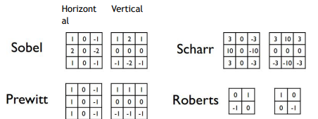

# Deteccion de bordes

La idea de utilizar la deteccion de bordes es para poder poder extraer ciertas caracteristocas de algunas imagenes, ademas de volverlo mas compacto.
 

Los filtros derivativos mas comunes se usan para la deteccion de bordes como lo son horizontales o verticales.

 

Esto se logra gracias a las derivadas ya que nos permite detectar esos cambios de valores en los pixeles cercanos, ademas la segunda derivada el cual su signo indicara la direccion del gradiente del punto de interes, como positiva o negativa.

## Gradiente de una imagen

Es una herramienta fundamental en vision por computadora, ya que permite analizar la variacion de intensidad de los pixeles en una imagen.
 
El vector nos permite  medir la dirección y la magnitud del cambio en la intensidad de los pixeles.

<ol>
    <li>Operador de sobel</li>
        <ul>Calcula las derivadas parciales de la imagen en las direcciones horizontal y vertical utilizando mascaras convolucionales, luego la magnitud del gradiente se calucula combinando las derivadas parciales.</ul>
    <li>Operador de Prewitt</li>
        <ul>Es similar al operador de Sobel, aunque este utiliza diferentes mascaras de convolucion para realizar el calculo de las derivadas.</ul>
    <li>Operador de Roberts</li>
        <ul>Utiliza tambien mascaras convolucionales mas simples que las anteriores, calcula las difereencias de intensidad entre pixeles adyacentes en diagonal para detectar bordes mas finos.</ul>
    <li>Operador de Canny</li>
        <ul>Es un metodo mas avanzado que consta de varios pasos, primero suaviza la imagen para reducir el ruido que pueda tener este, calcula despues el graidente de la imagen para encontrar la magnitud y la direccion del cambio de la intensidad despues realiza un proceso llamado supresion de no maximos para afinar los bordes detectados y finalmente utiliza el umbral para detectar los bordes finales</ul>
    <li>Operador Laplaciano</li>
        <ul>Calcula la segunda derivada de la imagen para detectar cambios de intensidad abruptos, puede llegar a ser sensible al ruido por lo que se aplica despues de suavizar la imagen</ul>    
</ol>