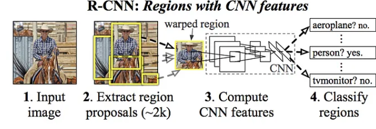
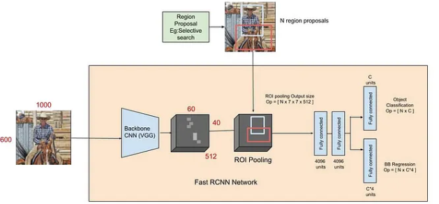
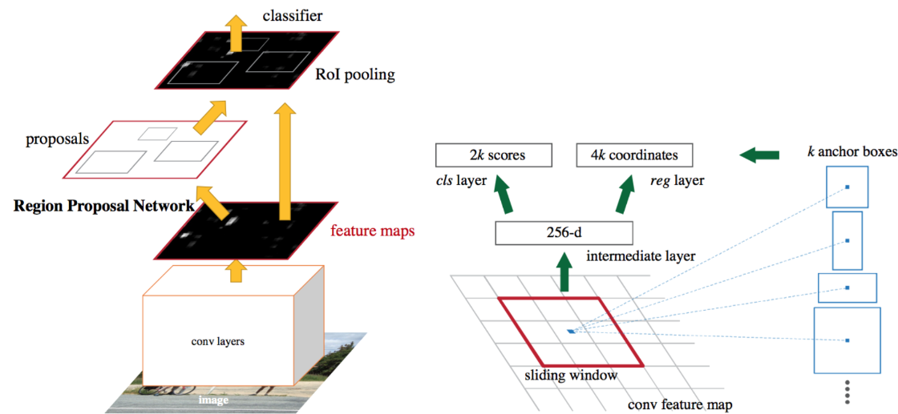

# Deteccion de bordes

La idea de utilizar la deteccion de bordes es para poder poder extraer ciertas caracteristocas de algunas imagenes, ademas de volverlo mas compacto.
 

Los filtros derivativos mas comunes se usan para la deteccion de bordes como lo son horizontales o verticales.

 

Esto se logra gracias a las derivadas ya que nos permite detectar esos cambios de valores en los pixeles cercanos, ademas la segunda derivada el cual su signo indicara la direccion del gradiente del punto de interes, como positiva o negativa.

## Gradiente de una imagen

Es una herramienta fundamental en vision por computadora, ya que permite analizar la variacion de intensidad de los pixeles en una imagen.
 
El vector nos permite  medir la dirección y la magnitud del cambio en la intensidad de los pixeles.

<ol>
    <li>Operador de sobel</li>
        <ul>Calcula las derivadas parciales de la imagen en las direcciones horizontal y vertical utilizando mascaras convolucionales, luego la magnitud del gradiente se calucula combinando las derivadas parciales.</ul>
    <li>Operador de Prewitt</li>
        <ul>Es similar al operador de Sobel, aunque este utiliza diferentes mascaras de convolucion para realizar el calculo de las derivadas.</ul>
    <li>Operador de Roberts</li>
        <ul>Utiliza tambien mascaras convolucionales mas simples que las anteriores, calcula las difereencias de intensidad entre pixeles adyacentes en diagonal para detectar bordes mas finos.</ul>
    <li>Operador de Canny</li>
        <ul>Es un metodo mas avanzado que consta de varios pasos, primero suaviza la imagen para reducir el ruido que pueda tener este, calcula despues el graidente de la imagen para encontrar la magnitud y la direccion del cambio de la intensidad despues realiza un proceso llamado supresion de no maximos para afinar los bordes detectados y finalmente utiliza el umbral para detectar los bordes finales</ul>
    <li>Operador Laplaciano</li>
        <ul>Calcula la segunda derivada de la imagen para detectar cambios de intensidad abruptos, puede llegar a ser sensible al ruido por lo que se aplica despues de suavizar la imagen</ul>    
</ol>

# Deteccion de Objetos

Clasificacion -> Es decir si dentro de la imagen el objeto existe o no existe
>
Clasificacion y localizacion -> Es lo mismo de poder detectar si esta o no esta en la imagen el objeto y ademas ponerle un recuadro en la ubicacion donde este.
>
Deteccion de objetos -> Es poder detectar mas de un objeto dentro de una imagen.
>
Segmentacion por instancia -> Es mas especifica que la deteccion de objetos.
>
La deteccion de objetos lo que pide es poder tener 2 tareas, clasificar y regresion, que seria la parte de tener la etiqueta de donde esta el objeto en la imagen, que viene siendo el bounding box
>
## R-CNN, Fast R-CNN, Faster R-CNN

La deteccion de objetos tiene diferentes puntos en los cuales se puede enfocar, como lo seria la estimacion de posicion, deteccion de vehiculos, en la parte de vigilancia y mas, lo que se busca es poder detectar un objeto, y colocarle un recuadro, pero si en la imagen hay varios poder identificarlos y colocarle individualmente el recuadro a cada uno.
>
La diferencia entre lo que seria un problema de clasificacion normal, es que hay imagenes con diferentes recuadros, lo que hace complicado la salida en el momento de poder crear el modelo, una forma de realizar esto podria ser tomando diferentes regiones de interes de la imagen, y usar un clasificador cnn, por lo que se usan algoritmos para poder hacer la deteccion de estos objetos, ya que al tener tantos recuadros puede tener un coste computacional demasiado alto.
>
## R-CNN
R-CNN es un algoritmo que se basa en la deteccion de objetos, desarrollado por Girshick, donde se propone un metodo en el cual se hace la seleccion de busqueda para poder extraer 2000 regiones de interes, estas regiones se pasan a lo que seria una red neuronal que produce una dimension de 4096 caracteristicas, donde el CNN extrae las caracteristticas, y despues se le pasa a un clasificador como lo seria SVM.
>

>
El problema es como se tienen al rededor de 2000 regiones de interes, el tiempo en el cual se demora en realizar todo este computo es demasiado alto.
El algoritmo de búsqueda selectiva es un algoritmo fijo. Por lo tanto, no se está produciendo ningún aprendizaje en esa etapa. Esto podría llevar a la generación de malas propuestas de regiones candidatas.
>
## FAST R-CNN
>
El mismo creador soluciono los problemas que tenia la arquitectura de R-CNN, en vez de pasarle las regiones de interes, lo que se hace es un proceso de convolucion para obtener lo que seria un mapa de caracteristicas, y de este identificamos la region de interes, la usando una capa de RoI pooling, la cual despues se le pasa a una red totalmente conectada, donde por la parte de la region de interes usamos una funcion de activacion softmax para poder predecir la clase, y valores atipicos.
>
Se empieza con una red pre entrenada con imagenet, despues de que pase la cap de convolucion se utiliza un algoritmo como lo seria busqueda selectiva para poder obtener esas regiones de interes posibles, despues se le pasa a una capa de RoI Pooling, esta es una capa piramidal, la cual divide entre las caracteristicas y las regiones de interes, 
>
La capa de Pooling de ROI es un caso especial de la capa de Pooling de Pirámide Espacial (SPP) con solo un nivel de pirámide. Básicamente, esta capa divide las características de las ventanas de propuestas seleccionadas (que provienen del algoritmo de propuestas de región) en sub-ventanas de tamaño h/H por w/W y realiza una operación de pooling en cada una de estas sub-ventanas.
Esto da lugar a características de salida de tamaño fijo de (H x W), independientemente del tamaño de entrada. H y W se eligen de manera que la salida sea compatible con la primera capa completamente conectada de la red.
>
Las características de salida de la capa de Pooling de ROI (N x 7 x 7 x 512, donde N es el número de propuestas) se introducen en las capas completamente conectadas sucesivas y en las ramas de softmax y regresión de cuadros delimitadores (BB-regression).
La rama de clasificación softmax produce valores de probabilidad de que cada ROI (Región de Interés) pertenezca a una de las K categorías y una categoría de fondo.
La salida de la rama de regresión de cuadros delimitadores se utiliza para hacer los cuadros delimitadores del algoritmo de propuestas de región más precisos.
>

>
## FASTER R-CNN
>
Ambos algoritmos anteriormente usan lo que seria la busqueda selectiva para encontrar las regiones de interes, por lo que  Shaoqing Ren et al, hizo un algoritmo el cual elimina esa busqueda, y deja que la red aprenda esas regiones de interes.
>
La imagen pasa a travez de una arquitectura de red neuronal, para obtener ese mapa de caracteristicas, y los verdadores bounding boxes son proyectados en ese mapa de caractristicas, normalmente se usa una resnet como la base.
>
Despues se tiene una RPN, donde es esta red que toma todo el resultado anterior y genera lo que seria las regiones de interes, donde son posibles ubicaciones de objetos en la imagen, se tiene que genera 9 cuadros limitadores, de los cuales son de diferentes formas y tamaños, los cuales van pasando detectando los objetos, prediciendo si es un fondo o un objeto.
>
Despues se tiene una capa de RoI Pooling, toma el resultado de la capa de RPN, y se ajusta a un tamaño predeterminado, y despues son pasadas a la siguiente etapa.
>
Se tiene una red de deteccion donde se procesa cada region de interes redimensionada, y lo que se hace es una clasificacion para determinar si es objeto o fondo, y un refinamiento para mejorar la precision de las cordenadas
>
