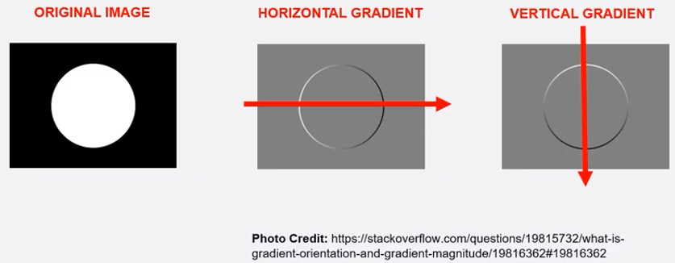
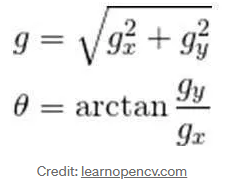
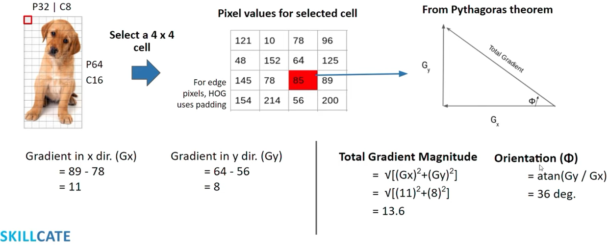
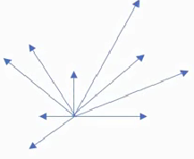

# Histogram of oriented gradients
Es un descriptor de caracteristicas para la deteccion de objetos.
>
Gradiente:
En la imagen siguiente tenemos una imagen la cual tiene un fondo negro, y en el centro un circulo blanco, cuando calculamos el gradiente de este de forma horizontal, se puede observar como tenemos un gradiente positivo ya que tenemos un cambio de valor positivo, y despues tenemos un cambio de valor negro que significa el cambio negativo en la imagen.
>
Esto ocurre de manera horizontal como vertical para el calculo del gradiente en una imagen.
>

>

>
En la imagen siguiente se observa el calculo de lo que seria el angulo y la orientacion.
>
Donde tenemos que se le calcula el gradiente en ambas direcciones y se resta, con el resultado de ambas se calcula la magnitud al igual que la orientacion que va a tener ese pixel.
>

>
Despues se llenan los histogramas con la relacion de la magnitud y de la orientacion, el  histograma del segundo es tiene 9 valores y va desde 0:20, 20:40, 40:60, 60:80, 80:100, 100:120, 120:140, 140:160, 160:180. y se van colocando las magnitudes donde correspondan segun los angulos.
>

>
Dependiendo de los angulos los cuales estan definido anteriormente y el calculo de las sumatoria de las magnitudes se puede definir el angulo que va a tener el pixel
La imagen se pasa a un tamaño de 64x128, en la cual se va a dividir en un subconjunto de 8x16, dentro de cada uno de estos cuadros se dividen una matrix 3x3 y despues se itera por cada cuadro, despues de esto la imagen se normaliza