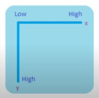
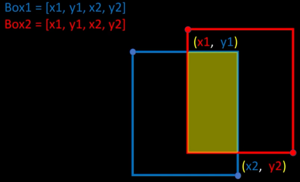

# Object detetection 

When working with images, there are several tasks we can perform: classification, segmentation, and object detection.
>
Initially, we have object localization, which involves finding something in an image and determining its position. However, this method can only detect a single object. Object detection, on the other hand, identifies what objects are present and their locations within the image, allowing for the detection of multiple objects.
>
For image classification, we use a Convolutional Neural Network (CNN). A CNN helps extract features from images and learn from these features to perform classification. Typically, we provide the images and their labels to assess the model's training performance.
>
For object localization, we follow similar principles by using images and their labels, but we also need the bounding box coordinates. These coordinates help the model learn by comparing its predictions with the actual values, allowing us to measure the model's accuracy and error rate.

## Sliding Windows
Sliding windows is a technique used for object detection. It involves using a fixed or variable-sized window to scan the image. We also define the number of steps that determine how far the window moves within the image. This technique is often used with image pyramids, which allow us to work with different image sizes, making it effective regardless of image dimensions.
>
One challenge of this method is its high computational cost. This is because the bounding box moves across every pixel, and the use of image pyramids means we have to handle various image sizes. Objects that are far away or too close can also affect the bounding box dimensions, resulting in multiple bounding boxes for a single object.

# Evaluate bounding boxes

## Intersection over union
IoU = (Area of intersection / Area Union)
>
When evaluating an image, we compare the predicted bounding box with the actual bounding box. The intersection is the overlapping area between the two bounding boxes, while the union is the total area covered by both bounding boxes. If the bounding boxes are apart, the IoU is 0. If they are close, the IoU will be a number between 0 and 1, with 1 indicating a perfect overlap.
>
- IoU > 0.5 decent
- IoU > 0.7 pretty good
- IoU > 0.9 almost perfect
>
When we get predictions and actual values, we have arrays with 4 numbers representing the positions of the top-left and bottom-right corners. Plotting these values makes it easier to identify the positions visually.
>
The top-left corner is the origin, and the values increase for the x and y coordinates towards the bottom-right corner.
>

>

>
When calculating the IoU from the previous image, we need to understand the positions. The top-left corner of both bounding boxes will be the maximum values, and the bottom-right corner will be the minimum values. For the intersection, the x-value (x1) and the y-value (y1) are taken from the inside values of both boxes. Similarly, the bottom-right corner values are x2 and y2. With these dimensions, we can calculate the intersection and use it to determine the IoU.

## Non Max Suppression
Non-Maximum Suppression (NMS) is a technique used to remove overlapping bounding boxes in object detection. It involves comparing the Intersection over Union (IoU) of bounding boxes and eliminating those that overlap too much, based on a predefined threshold. This helps reduce redundancy as overlapping boxes often contain the same information.
>
Here's an example of how NMS works:
>
- A: Score = 0.9, Bounding Box = [x1, y1, x2, y2]
- B: Score = 0.8, Bounding Box = [x1, y1, x2, y2]
- C: Score = 0.7, Bounding Box = [x1, y1, x2, y2]
- D: Score = 0.6, Bounding Box = [x1, y1, x2, y2]
>
Steps involved in NMS:

1. Order by Score: First, order the bounding boxes based on their scores in descending order.
2. Select the Best Score: Select the bounding box with the highest score.
3. Calculate IoU: Calculate the IoU between the selected bounding box and the remaining boxes.
4. Apply Threshold: If the IoU is greater than a threshold (e.g., 0.7), remove the overlapping boxes.
5. Repeat: Repeat the process for each remaining bounding box.
>
By following these steps, NMS ensures that only the most relevant bounding boxes are retained, improving the accuracy and clarity of object detection results.

## Mean Average Precision (maP)
When we want to calculate the mAP, we first need to test our predicted bounding boxes (bbox) with the real bounding boxes. After calculating the IoU, if it is greater than 0.6, then it is a TP; otherwise, it is an FP. After processing all the images and determining if each prediction is a TP or FP, we order them by their confidence scores and use the formulas for precision and recall.
>
Precision = TP / (TP + FP)
>
This represents the fraction of all bounding box predictions that were actually correct.
>
Recall = TP / (TP + FN)
>
This represents the fraction of all target bounding boxes that we correctly detected.
>
For each image and their bounding boxes, we calculate the precision and recall. After obtaining these values, we plot the precision-recall curve and calculate the area under the curve to obtain the AP.
>
We repeat this process for all classes and then calculate the mean of all the APs for the different classes to obtain the mAP.
>
The final step is to use different IoU thresholds and average the results of all these values together.