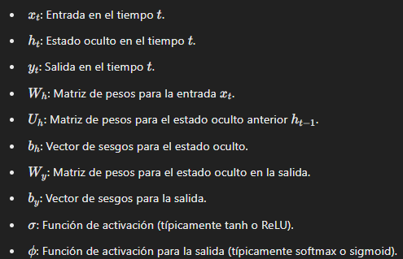
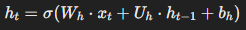
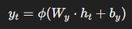

# Recurrent Neural Network
The RNN is a class of neuronal networks, that allow previous outputs to be used as inputs while having hidden states.
This is a variant of the conventional neuronal networks, because they can deal with sequence data, and be trained to hold knowledge about the past, ordinary networks work because they are independent of each other, so if we have data that requires information about previous data, we can use the RNN architecture because they can use the concept of memory that helps store information, and this helps to generate the following output of the sequence.
Notations:

xt viene siendo nuestro estado actual, la palabra con la cual se esta trabajando
ht es un estado oculto que representa un vector el cual representa la memoria de la red en el tiempo t, captura informacion de los pasos anteiores, en cada paso el peso se actualiza